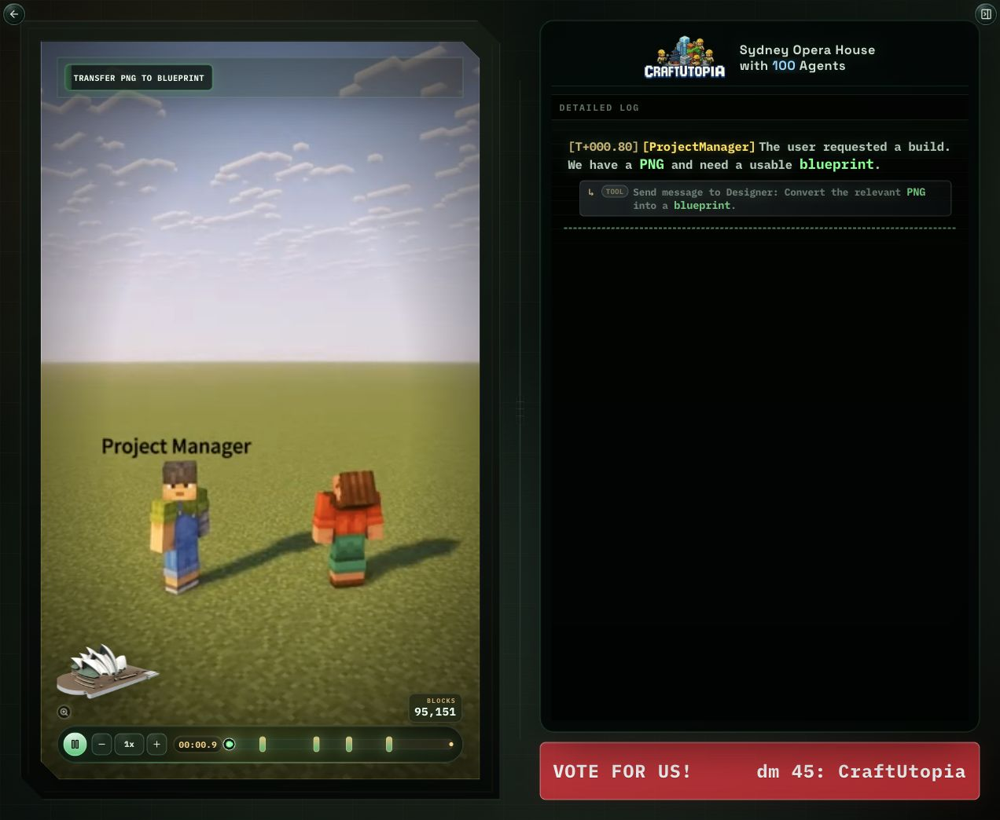
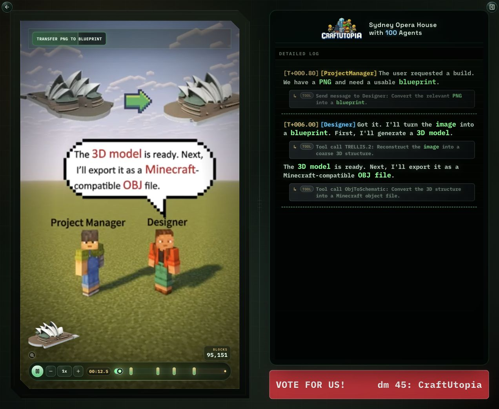
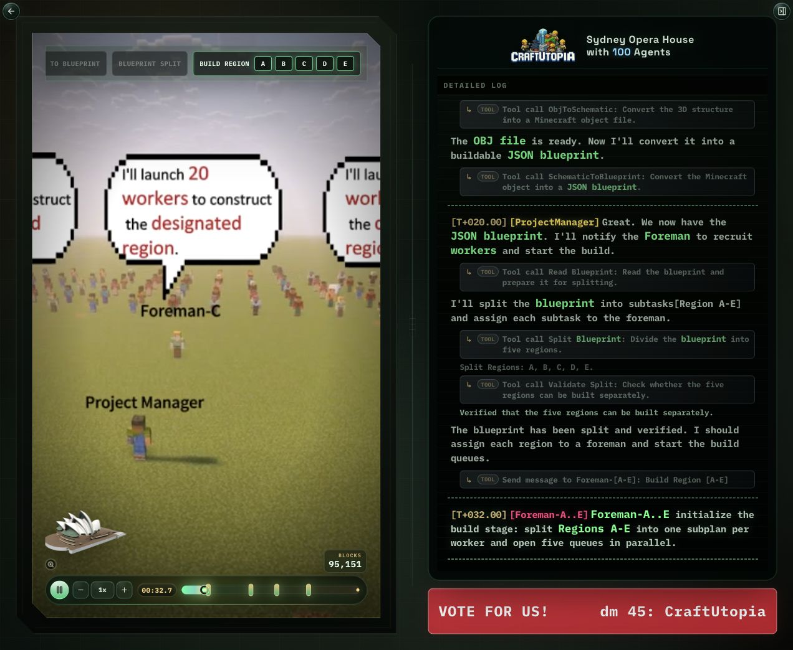
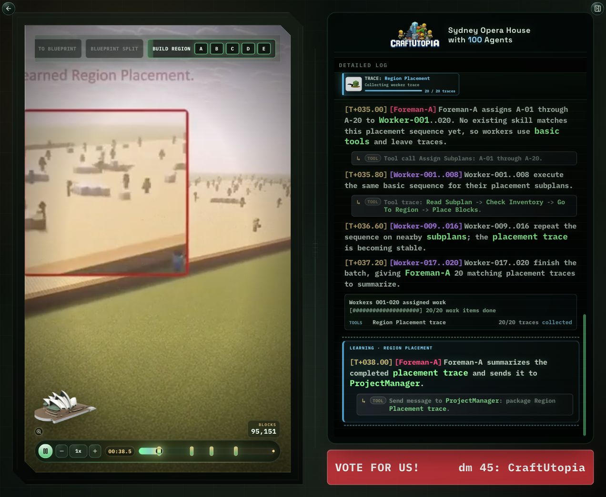
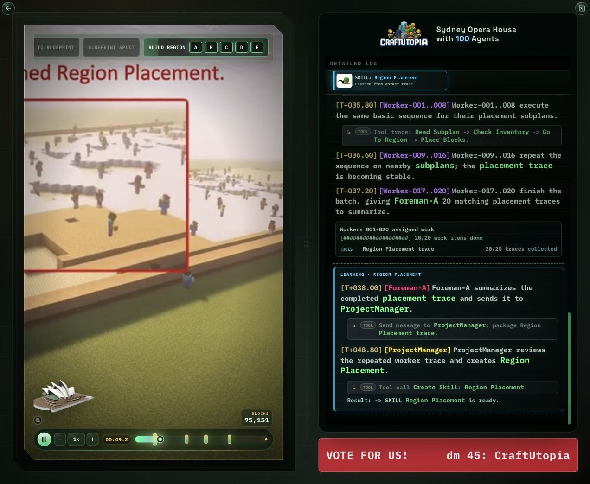
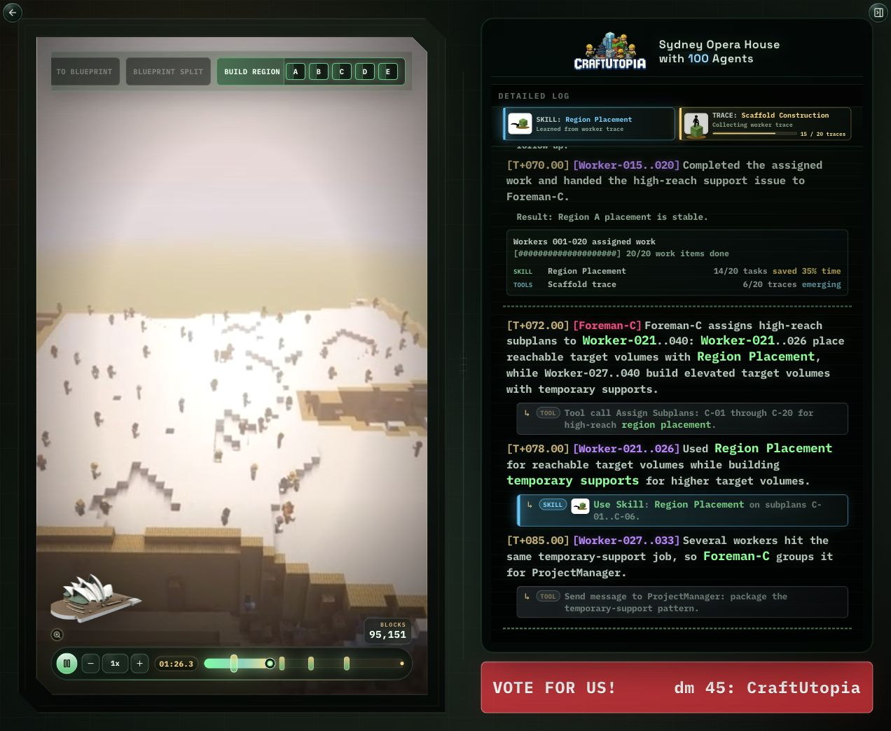
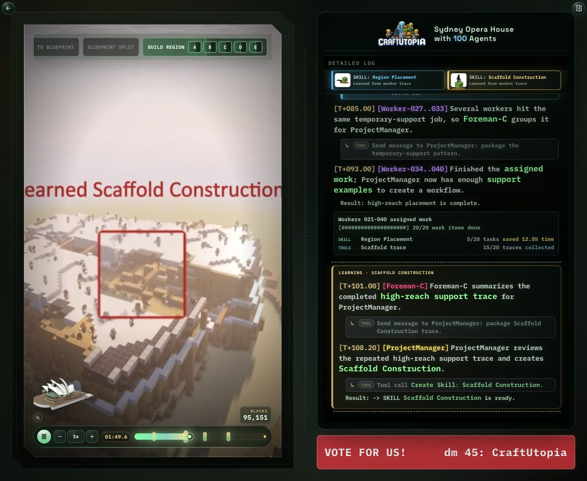
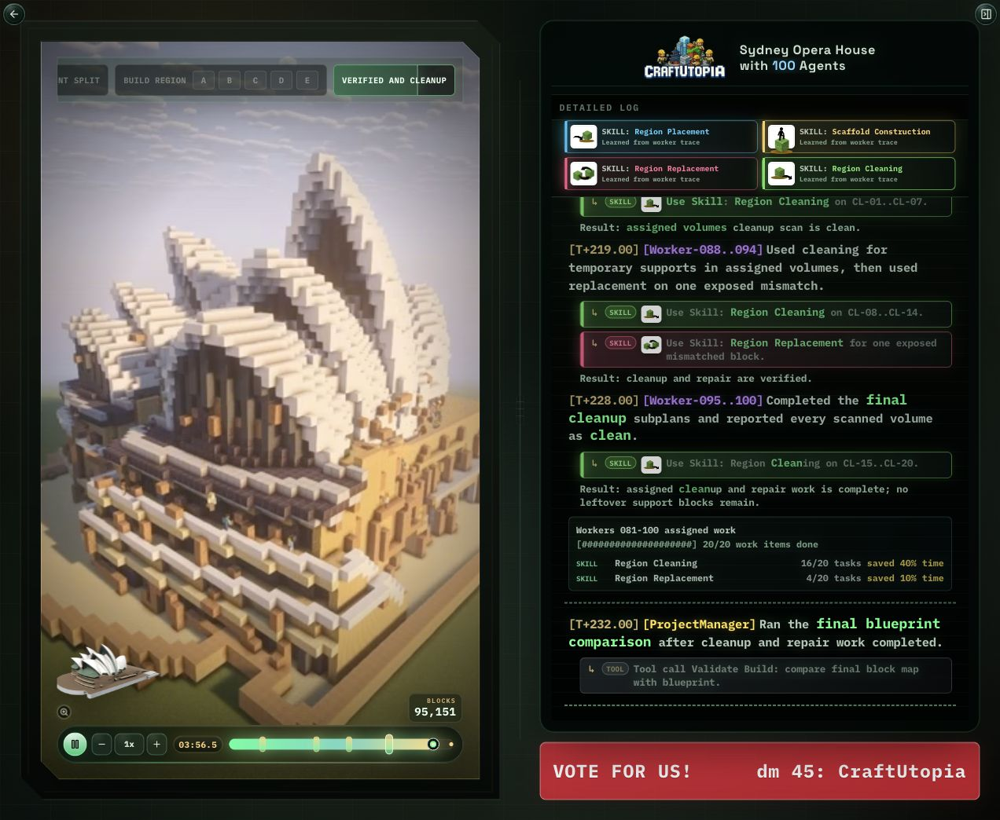

# CraftUtopia Demo Presentation Guide

以 Sydney Opera House demo 为主线，用于对外介绍 CraftUtopia 的系统设计、页面展示逻辑、关键截图讲解与常见问答。

参考材料：
- Demo 页面：`http://localhost:8000/demos/viewer/?demo=sydney-opera-house`
- Paper：`assets/AAMAS_2026_CraftUtopia_A_LLM-based_Multi-Agent_System_for_Collaborative_Construction_in_Minecraft.pdf`
- 当前 demo 数据：`data/demos/sydney-opera-house/demo.json` 与 `data/demos/sydney-opera-house/milestone-log-preview.json`

## 1. 一句话介绍

CraftUtopia 是一个基于 LLM 的多智能体 Minecraft 建造系统。它从单张 2D 参考图像出发，先生成可建造的 3D 蓝图，再由 ProjectManager、Foreman 和 Worker 组成的分层团队并行完成建造，并在过程中把重复出现的 worker tool trace 总结成可复用的 SKILL。

对外讲 demo 时，不建议把右侧 log 理解为逐帧解释视频里每个方块的真实事件。更准确的说法是：

> 左侧视频展示建造进程，右侧 log 抽象展示系统如何组织、学习和复用能力。因为视频中的建造速度很快，log 用 Region、target volume、worker batch 和 SKILL trace 来表达关键机制，而不是逐块对齐。

## 2. Paper 中对应的核心观点

Paper 里的重点可以映射到 demo 的四个讲解点：

1. **从单张 2D 图像到 3D 建造**
   CraftUtopia 不依赖预定义模板，而是从单张 reference image 生成 Minecraft-compatible blueprint。

2. **Design + Build 两阶段**
   Design 阶段把图像转成 3D model、Minecraft object 和 JSON blueprint；Build 阶段把 blueprint 分解成空间不重叠的 region/subtask 并并行执行。

3. **分层协作**
   ProjectManager 负责全局分解和技能发布；Foreman 负责自己 region 的 worker 分配、trace 汇总；Worker 执行具体 tool 或 skill。

4. **Skill acquisition**
   初始没有预设技能。Worker 在执行重复任务时产生 tool trace，Foreman 汇总重复 trace，ProjectManager 把它 codify 成 SKILL，再广播给后续 worker 复用，从而减少重复规划并提高速度。

Paper 中报告的实验结论可作为讲解背景：CraftUtopia 在代表性建造任务中实现稳定成功，且随着 worker 数增加表现出更好的扩展性；系统还出现类似人类协作的涌现行为，例如临时支撑、完成后清理支撑、部分 worker 后期让出工作区等。

## 3. Demo 页面总览

这一屏适合作为开场，先让观众建立页面结构：

- **左侧视频区域**
  展示 Minecraft 中 100 agents 的建造过程。视频不是简单背景，而是系统运行的可视化证据。

- **右侧 detailed log**
  展示系统层面的抽象事件，包括 ProjectManager 指令、Foreman 分配、Worker batch、Trace 收集、SKILL 生成和使用。

- **顶部 milestone**
  表示 demo 所处阶段：`Transfer png to blueprint`、`Blueprint split`、`Build Region`、`Verified and CleanUp`、`Complete`。

- **SKILL / TRACE 区域**
  只展示已经出现或正在收集的能力，不展示预设 locked skill list。这个区域强调系统是动态发现能力，而不是一开始就知道所有技能。

- **底部 timeline**
  是统一控制器。拖动它会同步视频进度、log 展示、milestone 状态和 SKILL 状态。

推荐讲法：

> 这个页面不是普通视频播放器。它把视频、时间轴、log 和 skill learning 状态绑定在一起，帮助观众理解 CraftUtopia 在不同时间点如何组织 100 个 agents。

## 4. Design 阶段：从图像到蓝图

这一段对应 paper 的 Design stage。

讲解重点：

- 用户只提供一个目标建筑的 2D 图像。
- Designer 将图像转成 3D model，再转换为 Minecraft-compatible object。
- 最终产物不是一段自然语言描述，而是可被构建系统读取的 JSON blueprint。
- 右侧 log 中的 ProjectManager/Designer 交互说明了从 reference image 到 buildable blueprint 的过渡。

推荐讲法：

> CraftUtopia 的输入门槛很低：不是手工写建筑模板，也不是提前给完整 3D blueprint，而是从一张图开始。Design 阶段的目标是把视觉输入变成后续 agents 可以执行的结构化 blueprint。

## 5. Blueprint Split：把全局任务拆成 region

这一段对应从 Design 到 Build 的交接。

讲解重点：

- ProjectManager 读取 JSON blueprint。
- Blueprint 被拆成 Region A-E。
- 每个 region 被交给一个 Foreman。
- 这些 region 是空间上相对独立的 subtask，目的是降低 worker 之间互相干扰的概率。

推荐讲法：

> 多智能体建造的核心问题不是“让更多人一起做”，而是“让更多人不互相挡路”。所以 ProjectManager 先把建筑切成空间上分离的 region，再让不同 Foreman 管自己的 worker pool。

## 6. Build 初始化：五个 Foreman 并行开队列

这一部分在截图 03 和后续截图中都能看到。

页面含义：

- `Foreman-A..E initialize the build stage`
  表示五个 Foreman 同时收到 region。

- `one subplan per worker`
  表示每个 Foreman 会把自己的 region 再切成 worker subplans。

- `open five queues in parallel`
  表示 Build 阶段进入并行执行。

推荐讲法：

> 这里不是一个中央 planner 逐个指挥 100 个 worker。ProjectManager 只做全局分解；Foreman 负责更局部的分配；Worker 执行具体 subplan。这个层级结构正是 paper 中的 hierarchical coordination。

## 7. Trace 收集：第一批 worker 使用 basic tools

这一段是理解 SKILL 机制的起点。

讲解重点：

- 初始没有 `Region Construction` SKILL。
- Worker-001..020 接收类似的 placement subplans。
- 他们用基础 tools 反复执行类似序列：
  `Read Subplan -> Check Inventory -> Go To Region -> Place Blocks`
- 系统把这些重复出现的 tool sequence 视为 candidate trace。
- 底部 batch summary 展示 `Region Construction trace 20/20 collected`，说明 trace 收集完成。

推荐讲法：

> 这里不是系统预设了一个 Region Construction 技能，而是 worker 在执行中多次产生相似 tool sequence。Foreman 看到这些 trace 反复出现后，才有依据把它们汇总给 ProjectManager。

## 8. Learning Chunk：从 trace 到 SKILL

这一屏是 demo 的核心展示之一。

页面含义：

- 左侧视频中红框对应“学习发生”的视觉时间段。
- 右侧 learning chunk 使用淡色高亮，说明这不是普通 worker execution，而是系统在形成新技能。
- 流程为：
  1. Foreman-A collects the reported placement trace。
  2. ProjectManager reviews repeated worker trace。
  3. ProjectManager creates `Region Construction`。
  4. Result 显示 `-> SKILL Region Construction is ready`。
  5. ProjectManager publish 给 Foreman。
  6. Foreman broadcast 给后续 worker。

推荐讲法：

> 学习不是 worker 说“我学会了”，也不是 Foreman 直接建造。学习发生在重复 trace 被汇总之后，由 ProjectManager 把 trace codify 成可复用 SKILL，然后发布给 Foreman 和 worker pool。

## 9. SKILL 复用：为什么后续 batch 更快

这一段展示 skill acquisition 的收益。

讲解重点：

- 后续 worker batch 中，一部分任务直接调用 `Region Construction`。
- 另一部分任务仍然用 basic tools，因为它们遇到新的高处或异常场景。
- Batch summary 用两类指标解释：
  - `SKILL Region Construction 14/20 tasks saved ... time`
  - `TOOLS Scaffold trace 6/20 traces emerging`
- 这说明系统不是“一学会就万事解决”，而是已有 SKILL 处理相似任务，新问题继续积累 trace。

推荐讲法：

> 有了 SKILL 之后，相似任务可以跳过重复 LLM 规划，直接调用可执行 skill。与此同时，不相似的任务仍然通过 basic tools 完成，并继续产生新的 trace。这就是系统速度随时间提升的原因。

## 10. Scaffold Construction：第二个能力如何出现

这一屏展示 `Scaffold Construction` 的学习。

讲解重点：

- `Region Construction` 已经能处理可达 target volumes。
- 高处 target volumes 需要临时支撑。
- Worker 在高处任务中反复产生 support-related trace。
- Foreman-C 汇总 high-reach support trace。
- ProjectManager 创建 `Scaffold Construction`。

推荐讲法：

> 这个例子说明 SKILL library 是逐步扩展的。第一个 SKILL 解决基础 placement；当高处任务反复出现，系统再总结出 Scaffold Construction。它不是事先写死的技能列表，而是从实际 worker behavior 中抽取出来的能力。

## 11. Region Replacement 与 Scaffold Cleaning

这两个 skill 在 demo 后半段出现，讲解时可以简洁带过，但要说明它们分别解决什么问题。

- **Region Replacement**
  来自 repeated block-repair trace，用来处理 mismatch、missing、placeholder blocks 等修复任务。

- **Scaffold Cleaning**
  来自 repeated cleanup trace，用来清理 leftover temporary supports 和 cleanup artifacts。

推荐讲法：

> 前两个 SKILL 偏“建造”，后两个 SKILL 偏“修正与收尾”。这使 demo 不只是把结构堆起来，还展示了 build -> verify -> cleanup 的闭环。

## 12. Final Verification：验证与清理闭环

这一段对应 demo 的收尾。

讲解重点：

- ProjectManager 进行最终 blueprint comparison。
- Foreman-A..E 确认各自 region 状态。
- `temporary supports removed`、`replacements verified`、`cleanup clean` 表明系统完成验证和清理。
- `Complete` 不是视频播放结束按钮，而是系统任务状态完成。

推荐讲法：

> 最后一步不是“视频播完了”，而是 ProjectManager 和 Foreman 对最终 block map、cleanup 状态和 region acceptance 做确认。这样 demo 形成完整闭环：输入图像、生成蓝图、分区构建、学习技能、验证清理、完成任务。

## 13. 建议的 5 分钟讲解顺序

### 0:00-0:40 开场

> CraftUtopia 解决的是开放世界里的多智能体协作建造问题。输入是一张 2D 图片，输出是在 Minecraft 中由多个 agents 共同完成的 3D 建筑。这个 demo 用 Sydney Opera House 展示从图像到蓝图、从蓝图到并行建造、再到技能学习和验证清理的全过程。

### 0:40-1:30 Design 阶段

> 首先看左上 milestone：Transfer PNG to Blueprint。Designer 将图像转成 3D model，再转成 Minecraft-compatible blueprint。这里体现 paper 的 Design stage。

### 1:30-2:10 分区与层级协作

> 进入 Blueprint Split 后，ProjectManager 把 blueprint 拆成 Region A-E。每个 region 给一个 Foreman，每个 Foreman 再分配给自己的 worker。这个结构避免了 100 个 worker 被一个中央 planner 逐个控制。

### 2:10-3:10 Trace 与 Learning

> 初始没有 Region Construction。第一批 worker 用 basic tools 完成相似 placement，形成 20/20 trace。Foreman 汇总 trace，ProjectManager 创建 Region Construction，并广播给 worker pool。

### 3:10-4:00 复用与加速

> 后续 batch 中，相似任务直接使用 SKILL，所以更快；不相似任务继续用 tools，并产生新的 trace，例如 high-reach support trace，最终形成 Scaffold Construction。

### 4:00-5:00 验证与总结

> 最后系统学习到 Region Construction、Scaffold Construction、Region Replacement、Scaffold Cleaning。它不是一开始预设技能，而是从 worker trace 中动态形成。最终 ProjectManager 做 blueprint comparison，Foreman 确认各 region，完成验证和清理。

## 14. 每个 UI 元素该怎么解释

| UI 元素 | 对外解释 |
| --- | --- |
| 左侧视频 | Minecraft 中的实际构建进程，用于展示建造状态和学习时间段 |
| 红框 | 视频中系统正在学习或确认某个关键能力的时间窗口 |
| 顶部 milestone | 当前 demo 阶段，从图像转换到蓝图拆分、建造、验证和完成 |
| Region A-E | ProjectManager 进行空间分解后的并行构建区域 |
| 右侧 Detailed Log | 系统行为的抽象时间线，不逐块解释视频，而解释组织与学习机制 |
| TRACE 卡片 | 候选重复行为正在积累，还不是 SKILL |
| SKILL 卡片 | 由 ProjectManager 从重复 trace 创建并发布的可复用能力 |
| Batch summary | 当前 worker batch 中多少任务用 SKILL，多少任务仍用 tools 收集 trace |
| Timeline | 统一控制视频、log、milestone 和 skill 状态 |

## 15. 常见 Q&A

### Q1: 这些 SKILL 是一开始就写好的吗？

不是。产品表达上不能说有一个预设 locked skill list。系统一开始没有已发现 SKILL。Worker 通过 basic tools 执行任务，重复 tool sequence 被 Foreman 汇总，再由 ProjectManager 创建 SKILL。

### Q2: 为什么 log 不写具体建筑部件？

因为视频建造速度很快，log 不适合假装逐块解释。更可信的表达是抽象到 Region、target volume 和 worker batch。视频负责展示具体形状，log 负责解释系统机制。

### Q3: `TOOL` 和 `SKILL` 有什么区别？

TOOL 是基础操作或消息调用，例如读取 subplan、移动到目标位置、放置 blocks、发送消息。SKILL 是从重复 tool sequence 中总结出的可复用程序化能力，例如 Region Construction。

### Q4: Foreman 会直接建造吗？

不会。Foreman 负责分配、汇总 trace、向 ProjectManager 报告。真正执行建造的是 Worker。ProjectManager 负责全局分解、创建技能和发布技能。

### Q5: 为什么有 SKILL 后还会继续用 basic tools？

因为 SKILL 只适用于相似任务。遇到新的目标体积、高处支撑、mismatch 或 cleanup 问题时，worker 仍需要使用 basic tools，并继续留下新的 trace。

### Q6: 为什么说 SKILL 会让系统更快？

Paper 中的机制是减少重复 LLM replanning。相似任务不需要重新规划完整 tool sequence，而是直接调用已经 codify 的 SKILL。Demo 中 batch summary 的 saved time 表示这种加速效果。

### Q7: 视频和 log 是一一对应的吗？

不是逐帧、逐方块对应。它们在关键时间段上同步：例如视频红框和 learning chunk 对应同一学习窗口。log 是高层解释，不是低层逐块 telemetry。

### Q8: 为什么要用 ProjectManager / Foreman / Worker 三层？

这是为了可扩展。100 个 worker 如果由单个 planner 控制，会产生协调瓶颈。分层后，ProjectManager 只做全局 region decomposition；Foreman 管局部 worker；Worker 执行具体任务。

### Q9: 为什么要拆 Region A-E？

Region 拆分让不同 worker team 在空间上尽量不冲突。它对应 paper 中 spatially disjoint subtasks 的思想。

### Q10: Demo 中的 `Scaffold Construction` 是什么意思？

它表示高处目标体积需要临时支撑的重复行为被抽象成 SKILL。这里不要把 scaffold 理解成某个固定建筑部位，而应理解为一种 high-reach support workflow。

### Q11: `Region Replacement` 和 `Scaffold Cleaning` 分别解决什么？

`Region Replacement` 处理 mismatch、missing 或 placeholder blocks。`Scaffold Cleaning` 处理 leftover temporary supports 和 cleanup artifacts。它们让系统从“建起来”走向“验证通过”。

### Q12: 为什么 paper 说有涌现行为？

Paper 提到 worker 在没有显式指令的情况下发现如何使用支撑到达高处，并在不需要时清理支撑；后期部分 worker 会避免干扰其他人。Demo 中的 high-reach support trace 和 cleanup trace 可以作为这些行为的可视化解释。

### Q13: 这个 demo 和 MINDcraft 的区别是什么？

Paper 中比较了 MINDcraft：MINDcraft 依赖更强输入，在若干任务上仍然失败或耗时更长；CraftUtopia 使用单张 2D 图像，并通过分层协作和技能获取提高稳定性与扩展性。讲 demo 时不需要展开所有 benchmark 数字，但可以强调“输入更弱、协作更稳、可扩展性更强”。

### Q14: 所有 demo 都学习同样四个 SKILL 吗？

不是必须。当前多数建筑 demo 展示四类常见能力：Placement、Scaffold、Replacement、Cleaning。Pyramid 只展示 Region Construction，因为它的视频 keyframe 只对应这一类学习事件。原则是以视频和实际展示为准，不强行塞不存在的 SKILL。

### Q15: 如何用一句话收尾？

> CraftUtopia 的核心不是让 LLM 一次性写出完整建筑计划，而是让多智能体在执行中分工、观察重复行为、形成可复用技能，并随着构建过程持续提高效率。

## 16. Presenter Checklist

讲 demo 前确认：

- 页面打开：`/demos/viewer/?demo=sydney-opera-house`
- 先从总览开始，不要直接拖到后半段。
- 强调 log 是机制解释，不是逐块 telemetry。
- 讲清楚“没有预设 SKILL list”。
- 讲清楚 Foreman 不建造，Worker 建造。
- 学习流程必须按 `trace -> Foreman summary -> ProjectManager create -> publish -> broadcast -> later use` 讲。
- 如果被问到具体建筑部位，回答用 Region / target volume 的抽象表达。
- Q&A 时把问题拉回 paper 的两个机制：hierarchical coordination 与 skill acquisition。
